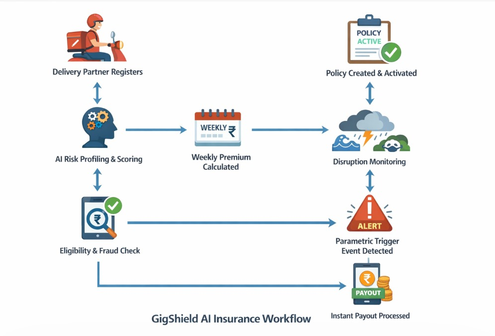
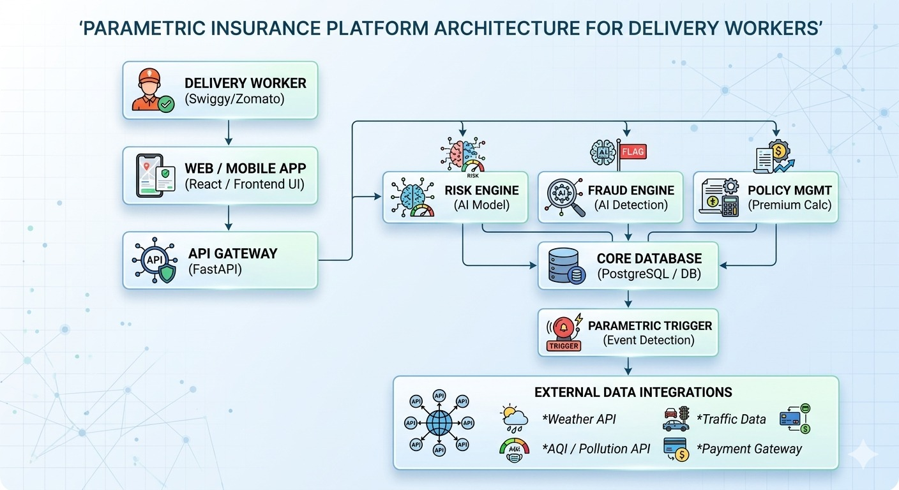

<h1 align="center">GigShield AI</h1>
<h3 align="center">Parametric Income Protection for Gig Workers</h3>

<h2>Problem Statement</h2>

India’s gig economy delivery workers (Zomato, Swiggy, Amazon, Zepto, etc.) depend on daily and weekly earnings. External disruptions such as extreme weather, pollution, floods, and sudden curfews significantly affect their ability to work, causing them to lose 20–30% of their income.

Currently, gig workers do not have any financial protection against these uncontrollable external disruptions.

Our solution aims to provide AI-powered parametric insurance that automatically compensates delivery partners when disruptions reduce their ability to work.

<h2>Target Persona</h2>
<h3>Food Delivery Workers (Swiggy / Zomato)</h3>
<ul>
  <li>Work outdoors for long hours</li>
  <li>Earnings depend on number of deliveries</li>
  <li>Highly affected by environmental disruptions</li>
</ul>

<h4>Example Scenario</h4>

A Swiggy delivery partner in Chennai cannot work due to heavy rain or floods, causing income loss.
GigShield AI automatically detects this disruption and provides instant payout.

<h2>Proposed Solution</h2>

GigShield AI is an AI-enabled parametric insurance platform that protects gig workers from income loss caused by environmental disruptions.

<h3>Key Capabilities</h3>
<ul>
  <li>AI-based risk profiling</li>
  <li>Dynamic weekly premium calculation</li>
  <li>Parametric triggers for automatic claims</li>
  <li>Real-time disruption monitoring</li>
  <li>AI-based fraud detection</li>
  <li>Instant payouts</li>
</ul>

<h2>Weekly Premium Model</h2>

Premium is calculated weekly based on income.

<table border="1" cellpadding="8">
<tr>
<th>Weekly Income</th>
<th>Premium (2%)</th>
</tr>
<tr>
<td>₹7000</td>
<td>₹140</td>
</tr>
</table>

<h2>Parametric Triggers</h2>

The system detects disruptions automatically using external data such as weather, pollution, and alerts.

<ul>
  <li>Rainfall > 100 mm</li>
  <li>Temperature > 42°C</li>
  <li>AQI > 350</li>
  <li>Flood warnings</li>
  <li>Curfew announcements</li>
</ul>

The system compares expected earnings vs actual earnings to calculate income loss and triggers payouts automatically.

<h2>AI Integration</h2>

<h3>AI-Based Risk Profiling</h3>
<ul>
  <li>Location risk</li>
  <li>Weather data</li>
  <li>Pollution levels</li>
  <li>Delivery demand trends</li>
</ul>

<b>Models Used:</b>

<ul>
  <li>Random Forest</li>
  <li>Logistic Regression</li>
  <li>Decision Trees</li>
</ul>

<h3>Fraud Detection</h3>
<ul>
  <li>Detects duplicate claims</li>
  <li>Validates location</li>
  <li>Checks activity status</li>
</ul>

<h2>Adversarial Defense & Anti-Spoofing Strategy<h3>
<h2>🛡️ Zero-Trust Adaptive Fraud Defense System</h2>

This system is designed to handle high-risk <b>Market Crash scenarios</b> involving coordinated fraud attacks such as fake GPS, bot claims, and payout exploitation.

GigShield AI uses a <b>multi-layer zero-trust architecture</b> where every claim is treated as suspicious until validated using intelligent checks.

<h3>🔹 Layer 1 — Geo-Spatial Authenticity</h3>
<ul>
  <li>GPS + IP + device fingerprint verification</li>
  <li>Detects fake GPS and abnormal movement</li>
  <li>Matches worker with disruption zone</li>
</ul>

<h3>🔹 Layer 2 — Economic Activity Verification</h3>
<ul>
  <li>Checks delivery activity before and during disruption</li>
  <li>Measures drop in orders and earnings</li>
</ul>

<pre>
If (Orders drop > 40%) AND (Disruption exists)
→ Eligible
</pre>

<h3>🔹 Layer 3 — Temporal Consistency Engine</h3>
<ul>
  <li>Detects bulk claim spikes</li>
  <li>Identifies synchronized claims</li>
</ul>

<h3>🔹 Layer 4 — Behavioral AI Engine</h3>
<ul>
  <li>Isolation Forest / anomaly detection</li>
  <li>Detects fraud clusters</li>
</ul>

<h3>🔹 Layer 5 — Trust Score System</h3>

<table border="1" cellpadding="8">
<tr>
<th>Score</th>
<th>Action</th>
</tr>
<tr>
<td>80+</td>
<td>Instant payout</td>
</tr>
<tr>
<td>50–80</td>
<td>Standard checks</td>
</tr>
<tr>
<td><50</td>
<td>Strict validation</td>
</tr>
</table>

<h3>🔄 Fraud Detection Workflow</h3>

<pre>
Claim Triggered
↓
Location Check
↓
Activity Validation
↓
Time Pattern Check
↓
AI Detection
↓
Trust Score
↓
Approve / Flag / Reject
</pre>

<h2>System Workflow</h2>

  

<ol>
<li>Registration</li>
<li>Risk Analysis</li>
<li>Premium Calculation</li>
<li>Policy Activation</li>
<li>Monitoring</li>
<li>Trigger Detection</li>
<li>Validation</li>
<li>Payout</li>
</ol>

<h2>System Architecture</h2>

  

Frontend → Backend → AI Engine → Database → External APIs → Payment System

<h2>Tech Stack</h2>

<table border="1" cellpadding="8">
<tr><th>Technology</th><th>Purpose</th></tr>
<tr><td>React.js</td><td>Frontend</td></tr>
<tr><td>FastAPI</td><td>Backend</td></tr>
<tr><td>Scikit-learn</td><td>AI Models</td></tr>
<tr><td>PostgreSQL</td><td>Database</td></tr>
<tr><td>OpenWeather API</td><td>Weather Data</td></tr>
<tr><td>Google Maps API</td><td>Location</td></tr>
<tr><td>Razorpay</td><td>Payout</td></tr>
</table>

<h2>Expected Impact</h2>
<ul>
  <li>Income protection for gig workers</li>
  <li>Fast automated payouts</li>
  <li>Fraud-resistant system</li>
  <li>Scalable insurance model</li>
</ul>

<h3 align="center">GigShield AI – Empowering Gig Workers 🚀</h3>
